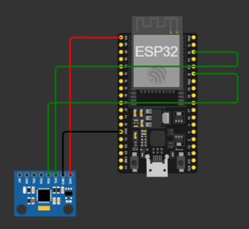

# Proyect MQTT Client ESP32 MPU6050

## Description

This is my project about MQTT Client with MPU6050 for one laboratory of my Master on IoT

## Specifications

Using ESP32 with Arduino firmware on C++

## Building project

Using PlatformIO the mount the proyect

```bash
pio build
```

## Hardware configuration

This is the diagram of the configuration



And this is the conextions table

| ESP32           | MPU6050 |
| --------------- | ------- |
| PIN22 (I2C SCL) | SCL     |
| PIN21 (I2C SDA) | SDA     |
| 3V3             | VCC     |
| GND             | GND     |

## Online Simulation project Wokwi

- [Here](https://wokwi.com/projects/384561989763778561) you can see my public my online public project on Wokwi

## Adafruit project Dashboard

- [Here](https://io.adafruit.com/icedeal/dashboards/practica-2-mqtt-dashboard) you can see my Adafruit IO Dashboard

## References

- [Project configuration](https://docs.wokwi.com/vscode/project-config)
- [MPU 6050 sensor](https://docs.wokwi.com/parts/wokwi-mpu6050)
- [Adafruit MQTT API Documentation](https://learn.adafruit.com/adafruit-io/mqtt-api)
- [MQTT Library Arduino](https://pubsubclient.knolleary.net/api#state)
- [ESP32 Wifi Networking](https://docs.wokwi.com/guides/esp32-wifi)
- [Wokwi + PlatfromIO tutorial simulation project](https://github.com/wokwi/esp32-http-server)
